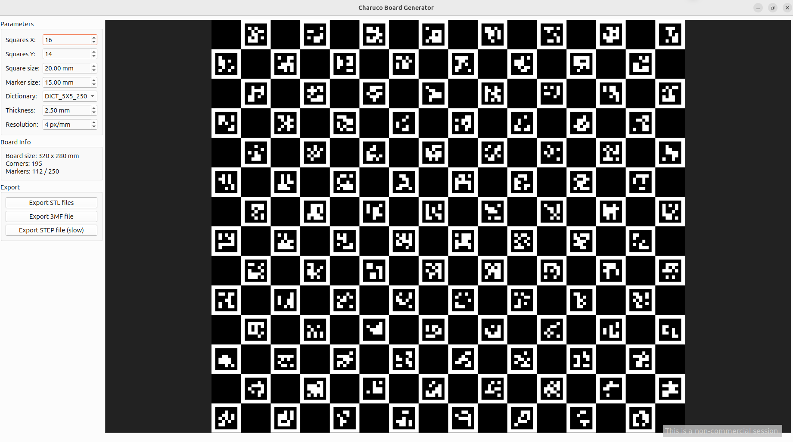

# Charuco Board Generator

Generate 3D-printable CharUco calibration boards with a GUI.

Outputs STL (black + white parts for dual-color printing), 3MF (single file with both parts), and optionally STEP (colored CAD assembly via CadQuery).



## Setup

### 1) Install uv

[uv](https://docs.astral.sh/uv/) manages the Python environment and dependencies. If you don't have it:

```bash
curl -LsSf https://astral.sh/uv/install.sh | sh
```

Then restart your shell, or run:

```bash
source $HOME/.local/bin/env
```

Verify with `uv --version`.

### 2) Clone and install

```bash
git clone git@github.com:ioannis-krmp/charuco-board-generator.git
cd charuco-board-generator
uv sync
```

`uv sync` creates `.venv/` and installs all dependencies from `pyproject.toml`: OpenCV, trimesh, shapely, CadQuery, PyQt6, numpy.

### 3) Verify

```bash
uv run python -c "import cv2, trimesh, shapely; print('OK')"
```

## Usage

```bash
uv run python charuco_gui.py
```

The GUI lets you configure:

- **Squares X / Y** — grid dimensions
- **Square size** — size of each checkerboard square (mm)
- **Marker size** — size of ArUco markers inside squares (mm), must be smaller than square size
- **Dictionary** — ArUco dictionary (e.g. DICT_5X5_250); must have enough markers for the board
- **Thickness** — board height in Z axis (mm), default 2.5
- **Resolution** — pixels per mm in the internal PNG raster (default 4 = 0.25mm precision)

The preview updates automatically as you change parameters. The info panel shows board physical size, corner count, and marker count vs dictionary capacity.

**Export options:**

- **Export STL** — two files (black + white) for dual-color 3D printing (~2 seconds)
- **Export 3MF** — single file containing both parts (~1 second)
- **Export STEP** — colored CAD assembly via CadQuery (slow, runs in background with progress)

### CLI tools

For scripted/batch workflows:

```bash
# Generate 3MF from existing STLs
uv run python build_3mf.py <black.stl> <white.stl> [output.3mf]

# Generate colored STEP from board PNG + metadata (slow)
uv run python build_step.py <board.png> <meta.txt> <output.step>
```

## Printing

Load both STL files (or the single 3MF) in your slicer:

- Keep the same origin — don't re-center either part
- Assign black filament to the black part, white filament to the white part
- Print sequence: **By layer**
- Add brim for large boards to prevent warping
- Measure printed square size with calipers and update your calibration config if needed

## Project structure

```
charuco_gui.py          # PyQt6 GUI application
charuco_stl_lib.py      # Shared STL generation library (trimesh + shapely)
build_3mf.py            # CLI: generate 3MF from existing STLs
build_step.py           # CLI: generate colored STEP via CadQuery
pyproject.toml          # Python dependencies
```

## Calibration YAML

For OpenCV camera calibration, use a YAML matching your board parameters (note: meters, not mm):

```yaml
dict_type: DICT_5X5_250
squares_x: 16
squares_y: 14
square_size: 0.020
marker_size: 0.015
```

## Troubleshooting

**"Could not load the Qt platform plugin xcb"** on Linux:

```bash
sudo apt install libxcb-cursor0
```

## License

MIT
